# Fightcord

[Website](https://jillthestingray.github.io/fightcord/) · **English** · [Português (Brasil)](README.pt-BR.md) · [Español](README.es.md)

**Fightcade, but it looks and works like Discord**, plus a stack of tools for competitive players.
One installer, no other downloads, everything runs inside the Fightcade app on your PC.

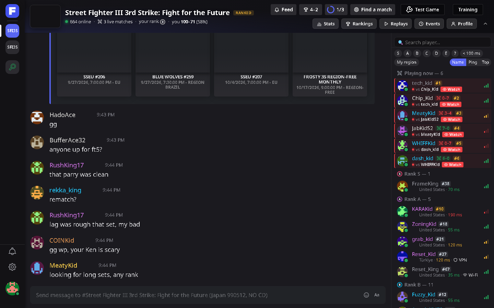

> Fightcord is a fan-made, client-side mod. It is **not** made by, affiliated with or endorsed by
> Fightcade or Discord.

## Download

Get **`FightcordSetup.exe`** from the [latest release](https://github.com/JillTheStingray/fightcord/releases/latest),
close Fightcade, run it and press **Install**. That's it: start Fightcade and a short welcome screen
walks you through the rest.

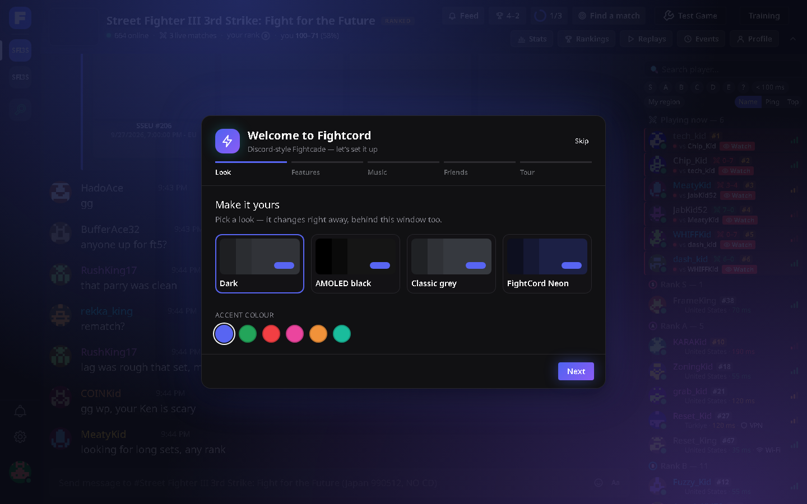

- Windows 10 / 11, the regular Fightcade 2 desktop app. No admin rights needed.
- The installer finds Fightcade by itself (Documents, OneDrive, `C:\Fightcade`, or a running
  Fightcade); otherwise press Browse.
- **"Windows protected your PC"?** The installer isn't code-signed (certificates cost money), so
  SmartScreen warns about it the first time: **More info → Run anyway**. Some antivirus programs
  are wary of new unsigned installers too: Malwarebytes, for one, may quarantine it as
  "MachineLearning/Anomalous", which is an AI guess rather than a known threat. Restore it from
  quarantine if you trust it, or build it yourself from this repo (see below).
- **Updates** happen inside Fightcade: when you open it, Fightcord checks this repo's releases and
  installs a new version before it loads (verified by checksum). You never need to come back here or
  run the installer again. If Fightcade stays open for days, a green button in the left rail offers a
  restart once an update is ready, and Settings → Updates shows what's new.
- **Uninstall:** run the installer again → Uninstall. Your settings are kept in a backup folder,
  and if you had Cerberus before, it can be put back.

## What you get

**The look**
- A Discord-style theme: Dark, AMOLED, Classic grey or FightCord Neon, any accent colour, your own
  chat background, or your own colours in the theme editor.
- A Discord-style channel rail, member list (grouped by rank, with ping, Wi-Fi/VPN warnings and
  leaderboard spots), hover cards, a profile popout and a right-click menu.
- The search tab as a Discover page made for you: your games with your rank and ELO, friends playing now,
  rivals who are free to play, live matches, this week's events, categories, instant search and game pages.
- A new login screen: game art behind a sleek card, the FightCord mascot, and a welcome back with your
  rank and last session.
- Chat: mentions, timestamps, link previews, jump to present, `:emoji:` shortcodes, font styles, and
  automatic translation of incoming chat.

| | |
|---|---|
| 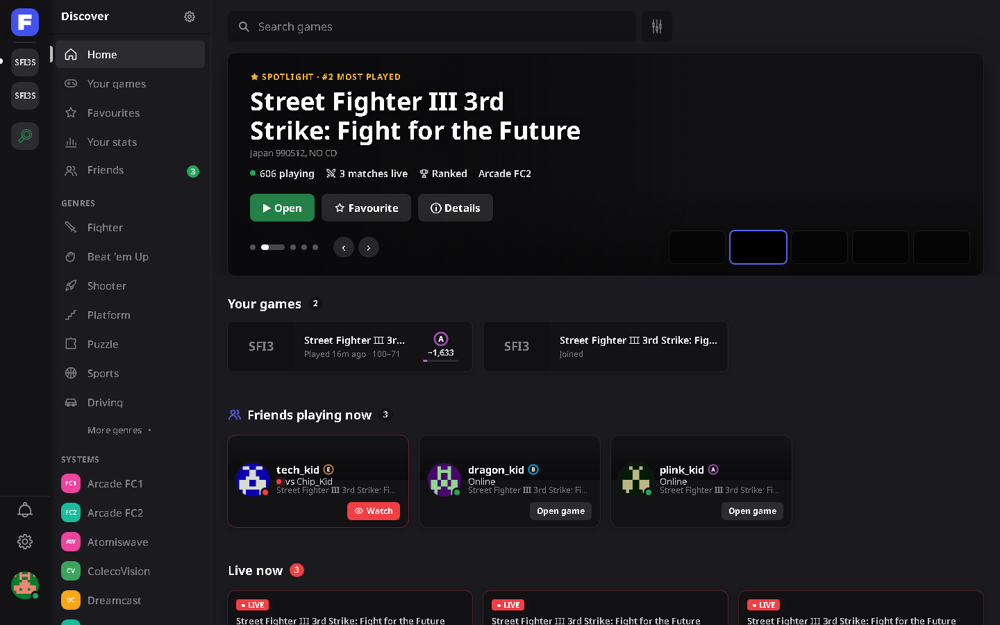 | 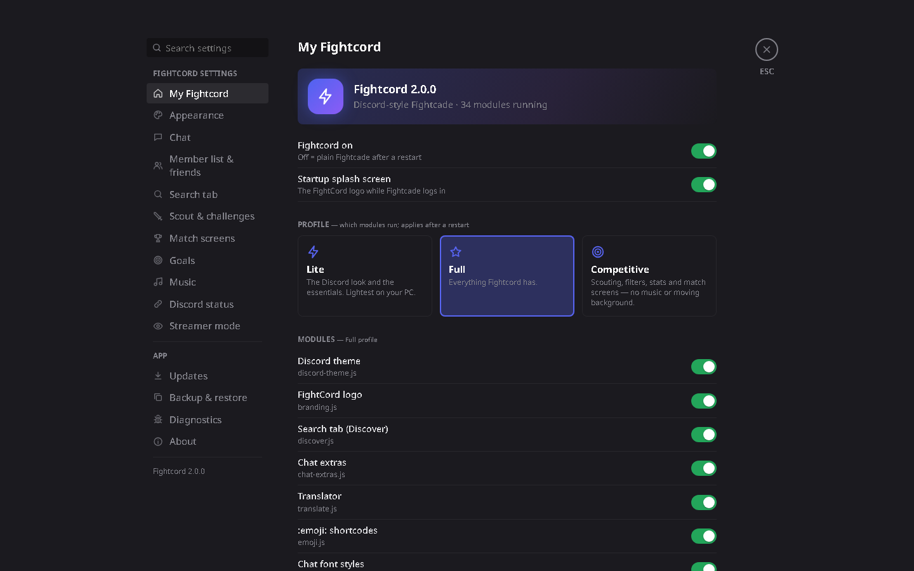 |
| 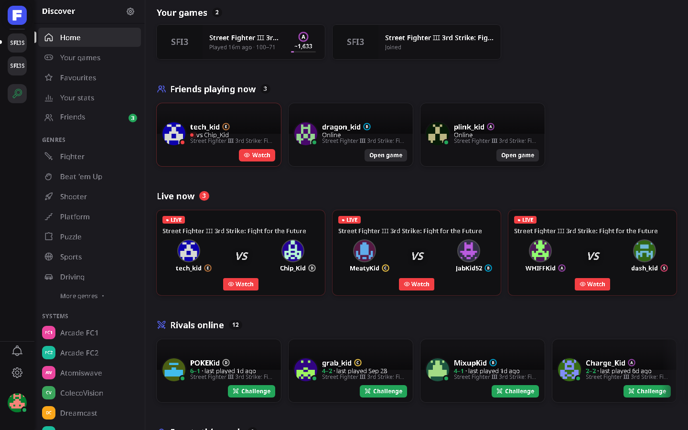 | 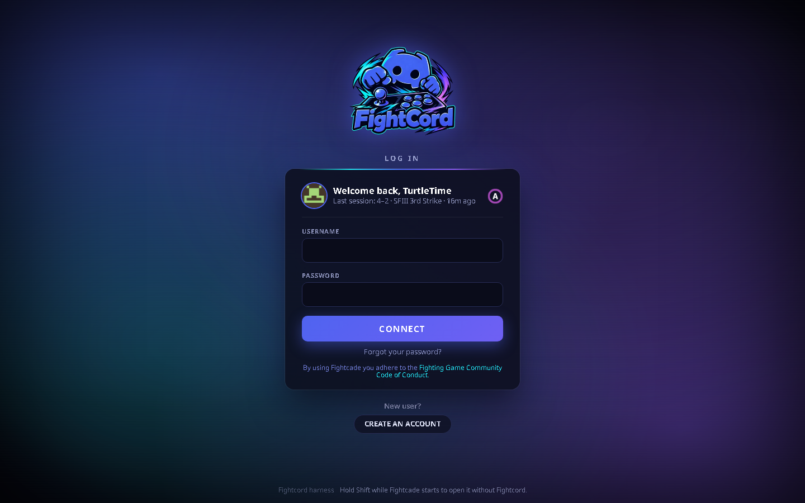 |

**For competitive players**
- **Scout card:** your opponent's rank, ELO, win odds and your head-to-head, the moment they
  challenge you. ELO is exact for Fightcade Patreon supporters (Fightcade only sends it to them),
  estimated from rank and leaderboard spot for everyone else. It also warns when someone often
  leaves ranked sets unfinished.
- **Challenge filters:** warn about or auto-decline challenges by ping, Wi-Fi / VPN, country,
  set length, rank, players you haven't met, or a block list.
- **Find a match:** one button lists who's free right now near your rank, on a good ping, new to
  you or close in your head-to-head, with your odds and a Challenge button.
- **Match screens:** VS / YOU WON! / YOU LOST!, and tonight's record in the channel header.
- **Stats:** your history, head-to-heads, streaks, and a share card.
- **Rank & ELO history:** a chart of your rank over time per game, and a celebration when you rank
  up.
- **Training goals:** "win 5 sets", "beat 3 A-ranks", "play an hour"… tracked live, with a
  session summary.
- **Match analytics:** win rate by opponent rank, ping, hour of day and set length, plus a tilt
  check.

| | |
|---|---|
| 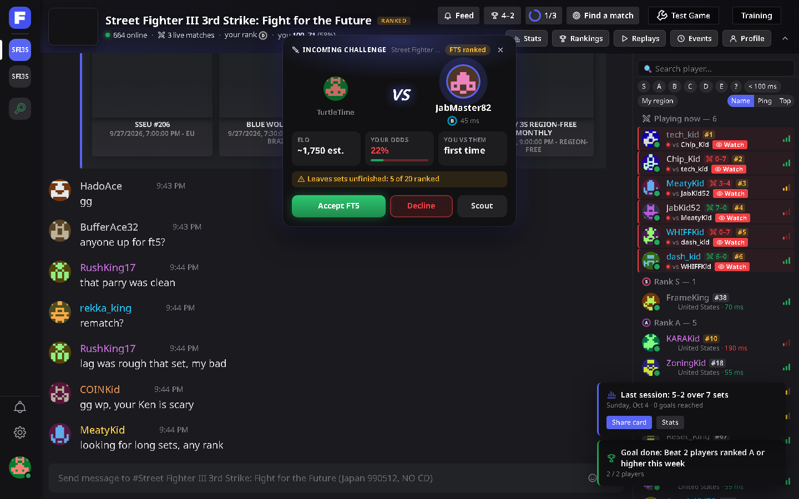 | 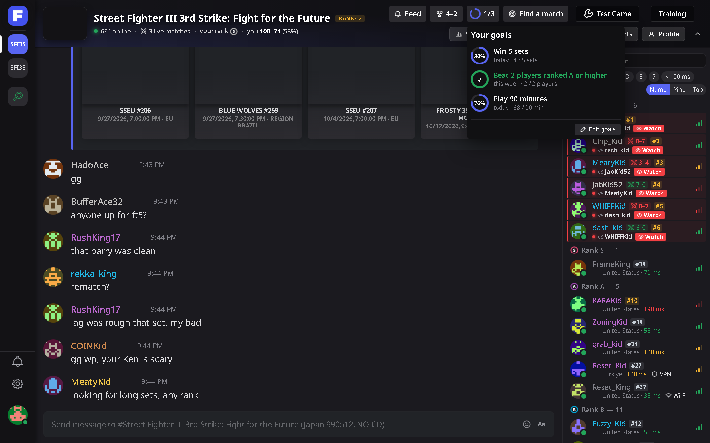 |
| 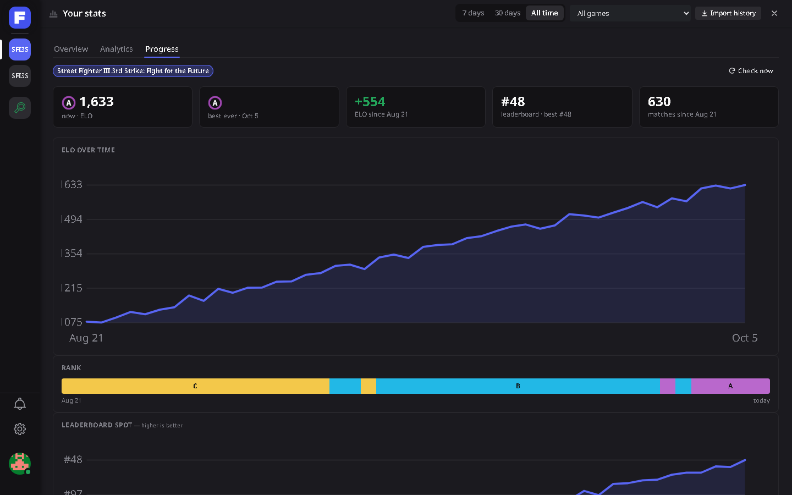 | 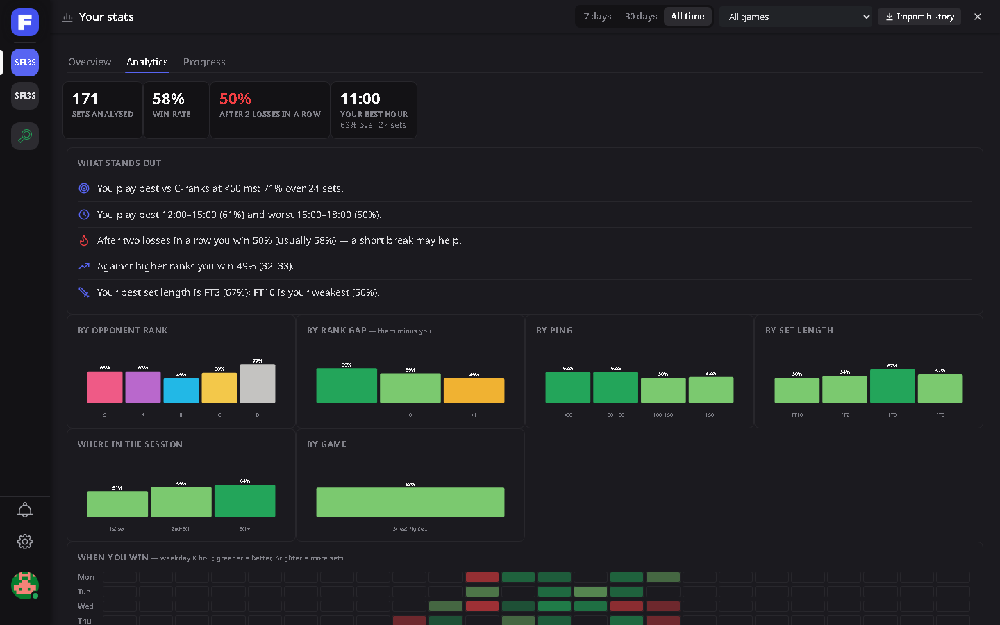 |

**Social**
- **Friends list** with online / match alerts and a Watch button, plus **player notes & tags**.
- **Lobby feed:** joins, matches you can watch, upsets and win streaks in each channel.
- **Event reminders:** a heads-up before Fightcade tournaments for your games start (or any
  event you ring the bell on), with a button to open the channel.
- **Discord status:** shows your game, opponent and match timer on your Discord profile.
- Lobby **music** (bring your own track; none is included).

**Streaming**
- **Streamer mode:** Ctrl+Shift+H blurs other players' names, avatars and chat on screen, keeps
  incoming challenges in a queue (one at a time, none mid-match) and quiets pop-ups that name people.
- **OBS overlay:** a scoreboard (you vs your opponent, ranks, the score, tonight's record) to add
  in OBS as a Browser Source.

| | |
|---|---|
| 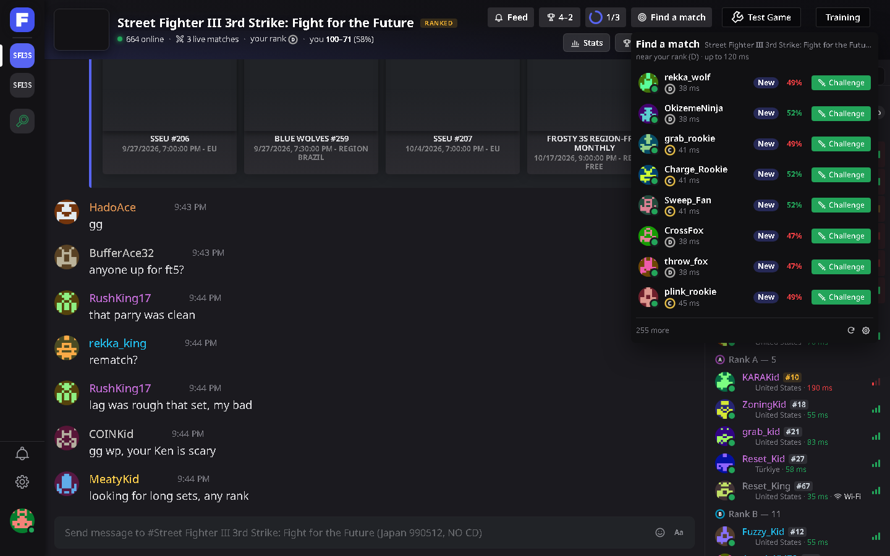 | 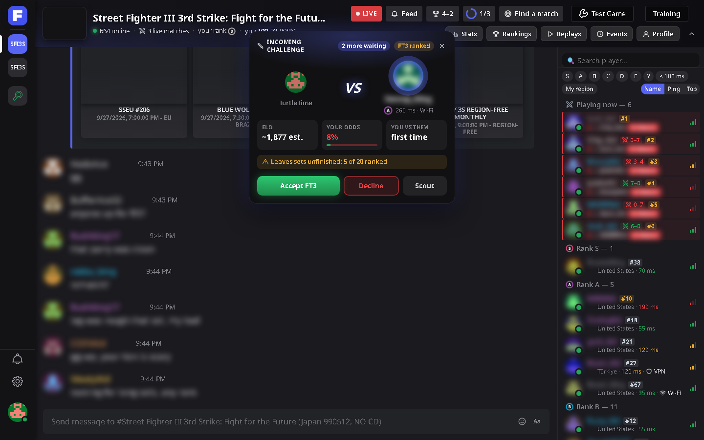 |

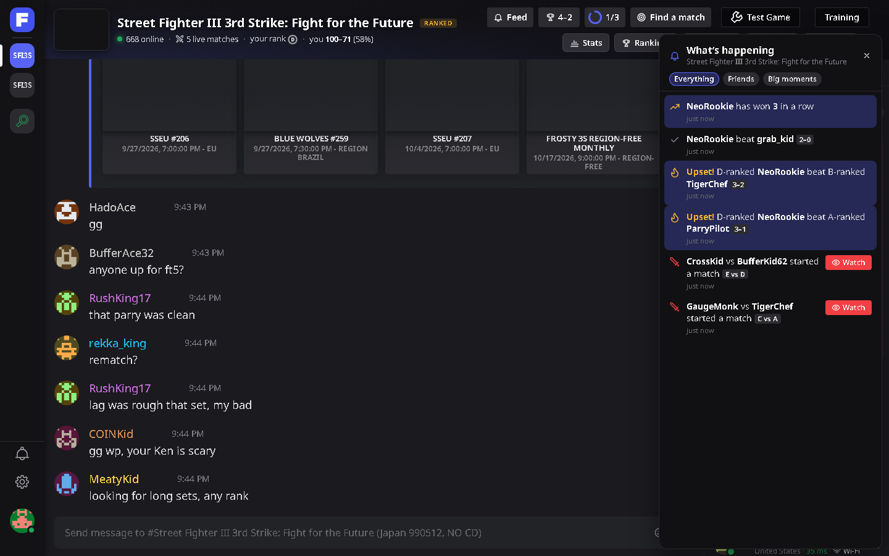

<sub>Screenshots use made-up players and chat.</sub>

Fightcord (and its installer) speaks **English, Português (Brasil) and Español**. It follows your
Windows language, or pick one in Settings → My Fightcord → Language.

Everything can be switched on or off: **Ctrl+,** opens the settings (or type `/fightcord`, and
`/help` lists every chat command). The **Lite / Full / Competitive** profiles switch whole groups at once.

## Privacy

Fightcord has no server and no analytics. It only talks to:

| What | Where | When |
|---|---|---|
| Player info, match results, leaderboards | Fightcade's own API (`web.fightcade.com`) | scout cards, stats, the feed, rank history; the same requests Fightcade itself makes |
| Chat translation | Google Translate (`translate.googleapis.com`) | incoming chat lines that aren't in your language, while the translator is on (Settings → Chat) |
| Link previews | YouTube / X / Streamable / Twitch | when a link to them appears in chat |
| Avatars, a font | Gravatar, Google Fonts | like Fightcade does |
| Updates | this GitHub repo | once a day |
| Discord status | the Discord app on your PC | while Discord status is on |
| OBS overlay | a page at `127.0.0.1` that only this PC can open | while the overlay is on (Settings → Streamer mode) |

Settings, notes, friends and match history stay in Fightcord's folder on your PC
(`<Fightcade>\fc2-electron\resources\app\inject\fightcord\`). Settings → Backup & restore saves them
to a file.

## Fair play

Fightcord only changes what you see and click in the Fightcade app. It never touches the
emulator, game memory, inputs or netcode, and it never plays matches or sends, accepts or declines
challenges on its own: challenge filters only decline challenges you told them to.

## FAQ

**Something looks broken after a Fightcade update.** Hold **Shift** while Fightcade starts to open
it without Fightcord (safe mode), then check Settings → Diagnostics, or open an issue with the
"Copy debug info" text.

**Can I use only some of it?** Yes: Settings → My Fightcord switches single modules, or pick the
Lite profile.

**Does it work with Cerberus?** Fightcord replaces it. The installer moves Cerberus into a backup
folder and brings your settings, match history and sounds along.

## Building it yourself

You need Windows, [Node.js](https://nodejs.org) 18+ and PowerShell (built in). The C# compiler
comes with Windows (.NET Framework 4).

```
powershell -ExecutionPolicy Bypass -File build.ps1
```

This installs the Discord-status library (`rpc/`, npm), syntax-checks everything, runs the tests
and writes `dist\FightcordSetup.exe`. `-Release` also writes the update zip and `latest.json`.

| Folder | What's in it |
|---|---|
| `src/` | `fightcord-core.js` (the shared core) and every module; `src/tests/` (`node --test src/tests/*.test.js`) |
| `src/dev-harness/` | a fake Fightcade for working on the UI in a browser; see [docs/DEVELOPMENT.md](docs/DEVELOPMENT.md) |
| `rpc/` | the Discord status plugin |
| `loader/` | the `inject.js` Fightcade runs at startup |
| `installer/` | `FightcordSetup.cs` (WinForms, C# 5), its icon / logo, and its translations (`i18n.json`) |
| `src/i18n-pt.js`, `src/i18n-es.js` | the translations; `node src/tools/i18n-check.js` shows anything missing |
| `docs/` | how it hooks into Fightcade, the installer, every module |

## License

[MIT](LICENSE). Fightcade, Discord and the games shown in Fightcade belong to their owners.
